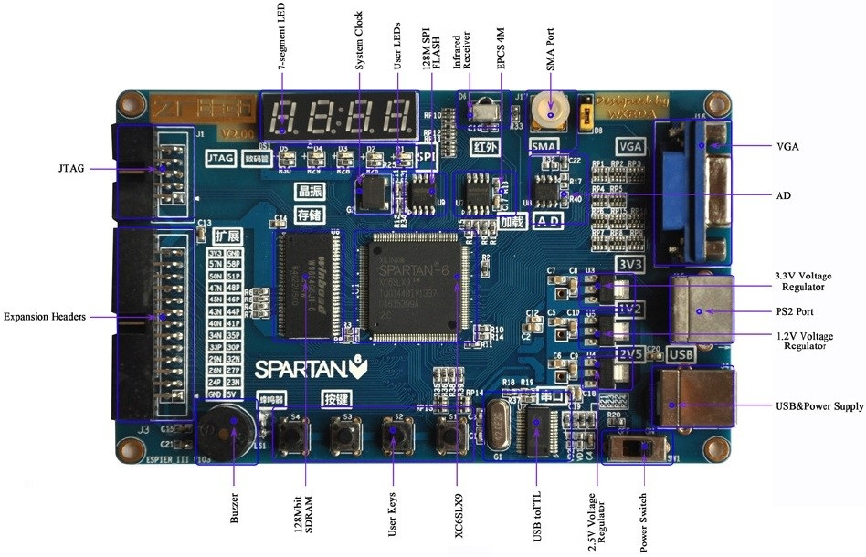

### FM Transmitter by FPGA
it's an FM Transmitter which implemented by **VHDL** (Xilinx ISE Design Suite) on the **XC6SLX9** evaluation board.
This board has an ADC (**TLC548C**) that it has an 8-Bit resolution and its input is SMA Port.
The analog audio signal will have entered into ADC and its digital data( by SPI) will have entered into FPGA. The transmitter frequency is 90 MHz. This project does not use any RF components. This uses a cool technique to make a frequency modulation that I saw this some years ago on this page: https://marsohod.org/projects/marsohod2/246-fmradio

In this technique, we will change square pulses in interleave mode. In this way, For example, we will generate 3 square pulses with period T1, Then generate 1 square pulse with period T2. As a result, we can average of periods to calculate frequency and by this method fragment the frequency.

